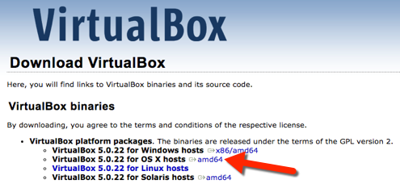
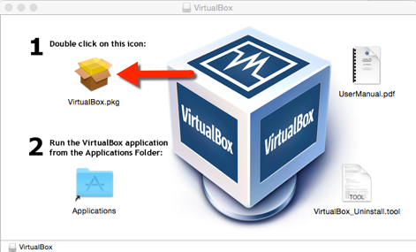
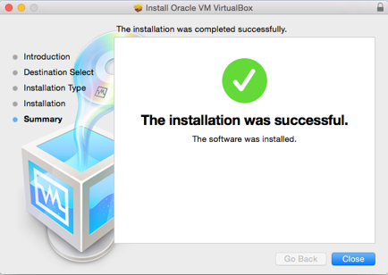
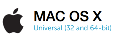
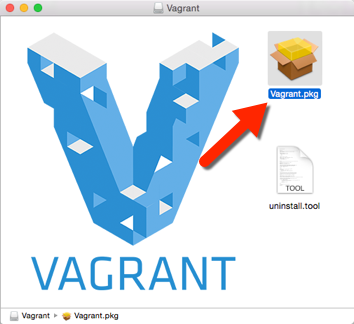
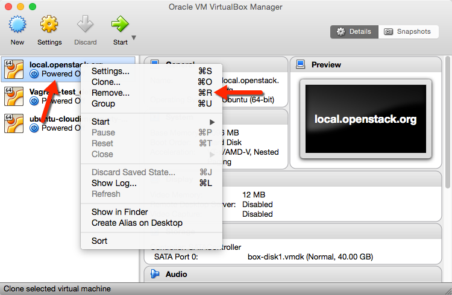
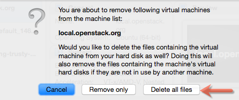

##**OpenStack Foundation Website**

### **Setting up the Development Environment - Virtual machine**

These instructions will detail the Vagrant method for installing the OpenStack Website development environment on your machine.  You will create a directory on your local machine and clone a github repository to this directory that will contain all of the necessary files to setup and operate your development environment.  The backend of your environment will run on a virtual machine (VM) that your development machine will host.  This VM will contain an Ubuntu Linux installation on which your web server (Nginx) and database (MySQL) will be installed and run.  Vagrant, a command line virtual machine management tool, will automatically set up and control this VM environment.  The configuration information for Nginx and MySQL are scripted and included in the Vagrant package, so there is no need for you configure anything related to this on the backend.  

The steps are outlined below but basically are as follows:

1. Install VirtualBox - the virtualization application that will control your VM.

2. Install Vagrant - the VM management tool

3. Create a directory on your development system and clone the OpenStack website repository in this directory.  The repository contains all files needed for a complete installation.

4. Run Vagrant up to install the actual development environment.  That’s it.

**First, install VirtualBox**

Install VirtualBox from [https://www.virtualbox.org](https://www.virtualbox.org) by clicking on the Install link.

You will be taken to the Download page to install the VirtualBox binaries. From here select the appropriate link for your architecture.  In this example, for OS X, select the following regardless of whether you have amd64 architecture:

Save this xxx-OSX.dmg file to your disk then open the file and double click the installation icon

For the remainder of the installation, follow the defaults and upon completion you will see the Success screen:

You have successfully installed VirtualBox.

**Next, install Vagrant**

Install Vagrant from [https://www.vagrantup.com/downloads.html](https://www.vagrantup.com/downloads.html)  by clicking on the Install link that is appropriate for your platform.  In this example, select MAC OSX:

Save this xxx.dmg file to your disk, then open the file as shown below and follow the defaults to the success screen.

:

You will use Vagrant from the Terminal to create, start, stop and remove your VMs.  

**Clone the OpenStack website repository**

For a clean installation and from the Terminal on OSX you will clone the OpenStack Foundation Website repository from the link below.  

Create a directory for the Vagrant installation (name it whatever you like and place it wherever you like. "vagrant" in the user’s home directory ~/ is the method shown here.

* From your newly created vagrant directory (~/vagrant/), 

* Run: git clone [https://github.com/OpenStackweb/openstack-org.git](https://github.com/OpenStackweb/openstack-org.git)

Next, you will need to edit your config file at (~/.ssh/config) with the correct identity information so that the private-assets submodule that is included in the repository can be loaded correctly.  **NOTE**: You may need to create this config file.

* Edit the config file using your text editor, such as vim, with the following information:  

	#private assets  
	Host assets.github.com  
	HostName github.com  
	PreferredAuthentications publickey  
	IdentityFile ~/.ssh/id_rsa  
  
**NOTE**: your identity file is the path to your private key, id_rsa in this example.  Your private key file may have a different name.

**Use Vagrant to create the development environment**

Create the development environment by running the following command from the "openstack-org" directory (~/vagrant/openstack-org). You will use Vagrant commands from this directory to handle management of the development environment.  

* Run: vagrant up

    * **NOTE**: You may need to enter your system user password during installation.

    * **NOTE**: If you get a host provision error you may need to add the following plugin and rerun vagrant up:

        * vagrant plugin install vagrant-hostmanager

Upon completion of the Vagrant install process, your development environment will be fully functional and the web server will be running.  You can check this by opening your browser and entering **local.openstack.org**

**Note: **If you can’t see the OpenStack website in your browser, you may need to restart the Nginx server.

**Working with your development environment **

**VAGRANT** - Use the below commands from the Terminal to stop and restart a vagrant session.  You will always type "vagrant up" from the project directory to re-start or recreate the same project.  You can have multiple projects in different directories with their own clone of the OpenStack website repository. 

* Useful Vagrant commands run from terminal in the openstack-org directory (~/vagrant/openstack-org)

        * vagrant suspend

            * Stops the virtual machine and saves the current state to disk.  

        * vagrant halt

            * Gracefully shuts down the virtual machine.  

        * vagrant destroy

            * Shuts down the guest machine and removes all guest hard disks and frees up hard disk space and RAM.  If you want to recreate the same VM, simply run "vagrant up" again and the project environment will build from scratch. **NOTE**: See section below REMOVING VIRTUAL MACHINES fore more information on this procedure.

        * vagrant status

            * Displays state of machines that Vagrant is running.  Use this to determine whether you are up and running or are in a suspended state.

**SHARED FILES - **The development environment contains a shared directory of your web files at the following locations.  **NOTE**: the vagrant  project directory is used here, if you put it in a different location it will impact the location on the host machine.

**Host Machine -** ~/vagrant/openstack-org

**Virtual Machine -** /var/www/local.openstack.org

**SSH** - Use SSH (Secure Shell) to securely access the virtual machine and run commands to on your web server and database.

* You can access your virtual machine by SSH in the openstack-org directory through the Terminal. 

    * Run: vagrant ssh

        * Password: vagrant

        * This will put you in the /home/vagrant directory on your VM.

    * Run: exit

        * This will end your SSH session and return you to the openstack-org directory on your development machine.

**RESTARTING YOUR WEB SERVER** - Follow the above instructions to access your VM through SSH. Then:

* Run: service nginx restart

You may have run the sudo (superuser do) command before the restart command if you are given a permission error.

* Run: sudo service nginx restart

**REMOVING VIRTUAL MACHINES**** - **Removing virtual machines is generally and seamlessly completed by running the "vagrant destroy" command from your project directory.  If, however, you need to remove a VM that cannot be destroyed by the “vagrant destroy” command, you can access the VM directly from the VirtualBox application on your development system, as shown below.

Launch the VirtualBox application from the Launchpad on your Mac.  Select the local.openstack.org VM, right click and select Remove:

You will be prompted as to whether you would like to delete the VM files from your hard disk as well.   Select Delete all files.  Running "vagrant up" again will recreate all backend files necessary for your development environment.

 NOTE: Vagrant will not allow you to create two separate OpenStack website development VM environments (local.openstack.org) on the same system.  Running "vagrant up" with an existing VM, even if the VM is not running, will stop the installation procedure and produce an error.  You can create a second environment in another directory with a second clone if you run the “vagrant destroy” command on the first environment.  

**NOTES**

* To get your vagrant ssh private key, go to the local directory of your site, (~/vagrant/openstack-org),

* Run: vagrant ssh-config

* Site is hosted on nginx under hostheader "local.openstack.org", your local path (site root) is mapped to /var/www/local.openstack.org on the guest machine (VM). VM ip is set to “192.168.33.10” so after vm installation you must add following entry to your host file in /etc/hosts

    * 192.168.33.10 local.openstack.org

* If you want to view your local database via a MySQL client like Sequel Pro, go to the local directory of your site and run

* ssh -i {/LOCALPATH TO OS WEBSITE}/www/openstack-org/.vagrant/machines/default/virtualbox/private_key -p 2222 vagrant@127.0.0.1 -L 3307:127.0.0.1:3306

* Your SQL client should use a Standard connection: - Host: localhost - Username: root - Password: root - Database: os_local - Port: 3306

## **About the database**

OpenStack will provide a database dump on a weekly basis, purged of protected data. The database will create one default admin user. All other data will need to be populated by the user.

